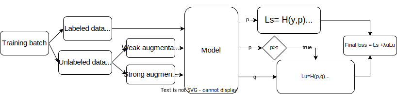
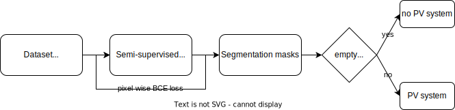

# PV systems semi-supervised segmentation
Semantic segmentation of PV systems based on [FixMatchSeg](https://arxiv.org/pdf/2208.00400.pdf) paper and [Solar panel segmentation](https://github.com/gabrieltseng/solar-panel-segmentation) github repository.

## 1. Introduction
This work uses recent overflight images from city and district of Munich and a [USA dataset] to train a semi-supervised segmentation model that identifies locations of PV systems in images.

### Datasets:
1. [**USA dataset**](https://figshare.com/collections/Full_Collection_Distributed_Solar_Photovoltaic_Array_Location_and_Extent_Data_Set_for_Remote_Sensing_Object_Identification/3255643): The labaled dataset used in the supervised part of the model.
2. [**Munich dataset**](https://geodaten.bayern.de/opengeodata/OpenDataDetail.html?pn=dop40): The unlabeled dataset used in the unsupervised part of the model.  
It undergoes two-step augmentation using [imgaug](https://github.com/aleju/imgaug):
    1. **Weak augmentation**: Random rotation in the range of [−20, 20] degrees + elastic distortion.
    2. **Strong augmentation** on weakly augmented images: Modify sharpness, contrast and add Gaussian blur.

### Model:
The segmentation model is a U-net using pixel-wise binary cross entropy as the loss function.

## 2. Pipeline

For data preprocessing of the labeled dataset and training segmentation, you can refer to the [pipeline](https://github.com/gabrieltseng/solar-panel-segmentation#3-pipeline) in the original Solar panel segmentation repository.

## 3. Results
The segmentation masks from the segmentation model were used to do image-wise classification, i.e. whether the image contains a PV system or not, since the segmentation model was originally trained on images containing PV systems and others not.

Both classification and segmentation were tested on 10% of the labeled Munich data and these were the results:  
**Classification**:
- Accuracy: 93.26%
- Precision: 89.83%
- Recall: 99.09%  
**Segmentantation** dice coefficient of 0.909

